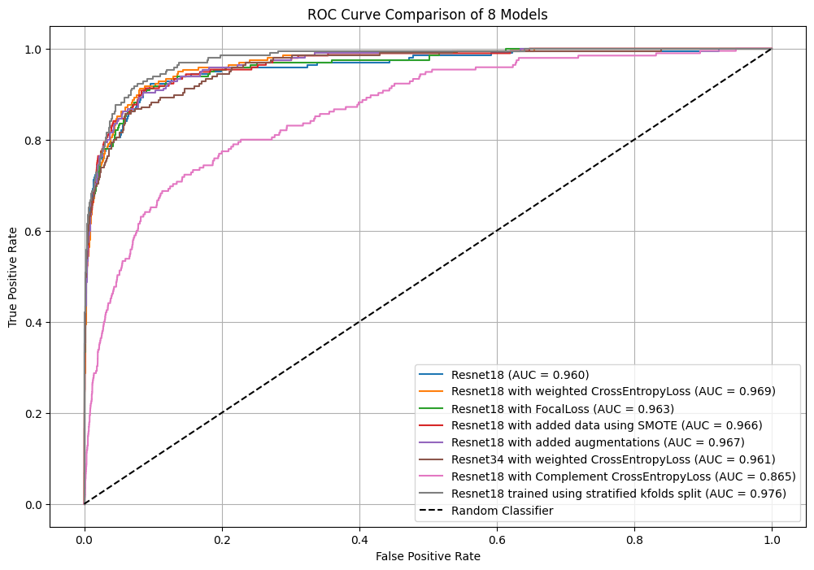
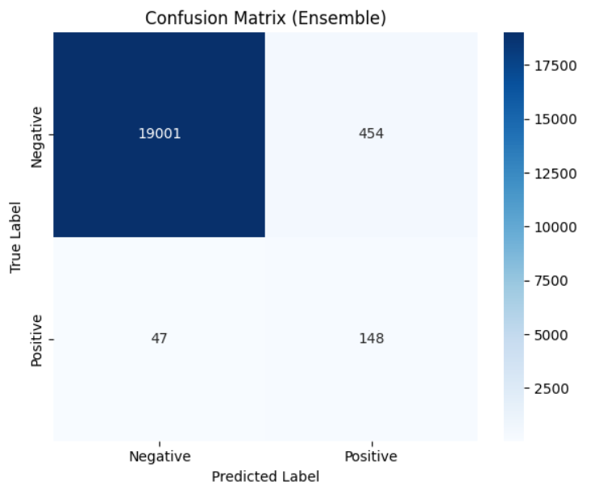
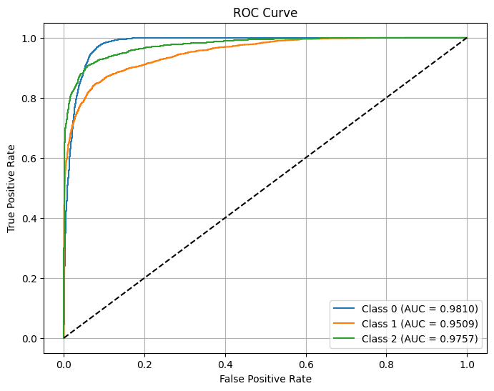
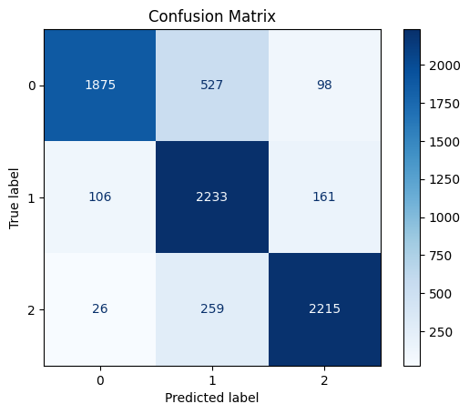

# Lens Finding Model

This repository contains a deep learning pipeline for lens-finding classification using ResNet architectures. The notebook explores different training strategies, loss functions, and data augmentation techniques to improve model performance. The dataset consists of images that require classification, with an emphasis on handling class imbalance and improving generalization.

## Project Overview
Gravitational lensing is an important phenomenon in astrophysics where massive objects bend light from background sources. Identifying strong lensing events in large-scale astronomical surveys is crucial for studying dark matter and cosmology. This project aims to develop a deep learning model capable of detecting such events.

## Features
- **ResNet Variants:** Implements ResNet-18 and ResNet-34 models for feature extraction and classification.
- **Loss Functions:** Experiments with different loss functions to improve performance:
  - Standard CrossEntropyLoss
  - Focal Loss to handle class imbalance
  - Complement CrossEntropy Loss
- **Data Handling:**
  - Uses `Albumentations` for image augmentations such as random cropping, flipping, and contrast adjustments.
  - Applies Synthetic Minority Over-sampling Technique (SMOTE) to generate additional samples of the minority class.
  - Implements Stratified K-Folds cross-validation to ensure balanced training and testing splits.
- **Training Enhancements:**
  - Uses ensemble learning by combining models trained on different folds.
  - Applies learning rate scheduling and optimization techniques to stabilize training.
  - Tracks performance metrics such as ROC AUC, F1-score, precision-recall, and confusion matrices.

## Results & Evaluation
### ROC Curve Comparison of 8 Models

| Model | AUC Score |
|-----------------|------------|
| ResNet18 | 0.960 |
| ResNet18 with weighted CrossEntropyLoss | 0.969 |
| ResNet18 with FocalLoss | 0.963 |
| ResNet18 with added data using SMOTE | 0.966 |
| ResNet18 with added augmentations | 0.967 |
| ResNet34 with weighted CrossEntropyLoss | 0.961 |
| ResNet18 with Complement CrossEntropyLoss | 0.865 |
| ResNet18 trained using stratified K-Folds split | 0.976 |
### Confusion Matrix

### ROC Curve Comparison for Multi-Class Task

| Class | AUC Score |
|-------|----------|
| Class 0 | 0.9810 |
| Class 1 | 0.9509 |
| Class 2 | 0.9757 |

### Confusion Matrix

- Uses ROC AUC, F1-score, and confusion matrices for performance evaluation.
- Implements visualizations to analyze model predictions and misclassifications.
- Ensemble learning helps in improving model robustness across different test splits.

## Future Improvements
- Experiment with additional deep learning architectures like EfficientNet or Vision Transformers.
- Implement semi-supervised learning for better feature extraction from unlabelled data.
- Optimize hyperparameters using Bayesian optimization techniques.

## Acknowledgments
This project utilizes open-source tools and datasets for deep learning-based lens-finding classification. Special thanks to the research community contributing to astronomical deep learning applications.

